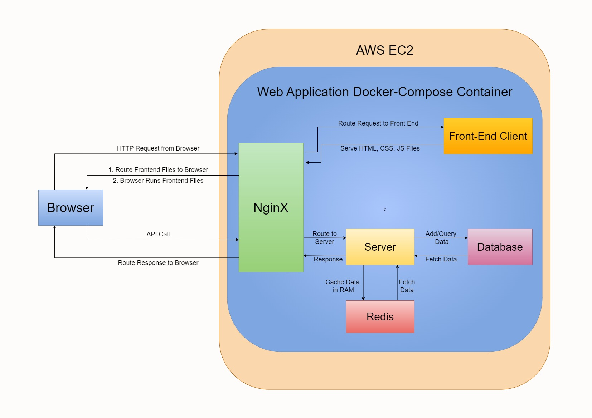

# Full-Stack Web Aplication - ECom by Chinmay
An E-Commerce Full Stack Website made on the MERN tech stack using TypeScript.


## Application URL (Hosted on AWS)
The application has been hosted on **AWS** and can be accessed at:
https://ecom.chinmaypillai.com


## Navigation

- [Architecture](#architechture)
- [Website Images](#website-images)
- [Technologies Used](#technologies-used)
- [Build](#build)


## Architechture


</br></br></br>

- User specific data of every user is stored as an encrypted document on a **MongoDB(NoSQL)** database and is update on interaction with the application.

- Implemented **User Authentication** using **JWT** & Data Encryption through hashing to securely verify & store user data

- Integrated **Redis** into architechture to improve app performace by caching user data for faster retrival and reduced latency

- Containerized the application using **Docker** and **Docker-Compose** and utilised **NginX** to act as a reverse proxy server

- Deployed on **AWS EC2** using **AWS Elastic Beanstalk** & **GitHub Actions** for deployment, scaling & load balancing

- Established **TLS** security and routing to custom domain using **AWS Route 53** and **AWS Certificate Management**

</br>


## Website Images


</br></br></br>

</br></br></br>

</br></br></br>


## Tech Stack:

1. React
2. Express
3. MongoDB
4. NginX
5. Docker & Docker-Compose
6. Redis
7. AWS EC2
8. AWS Elastic Beanstalk
9. AWS Route 53
10. AWS Certificate Management
11. Github Actions
12. NodeJs
13. Mongoose
14. axios
15. jasonwebtoken & jose
16. bcrypt
17. nodemon


## Build
To build and run the application in *production mode*:

```
docker-compose up -d --build
```


To run the application in *developer mode*:
```
docker-compose -f docker-compose-dev.yml up -d --build
```

To bring down the application:
```
docker-compose down
``` 

The website will be hosted on http://localhost:80


