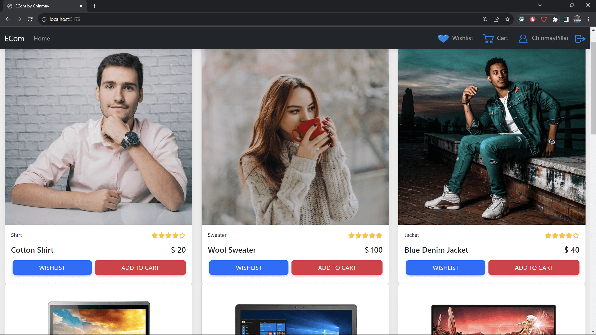
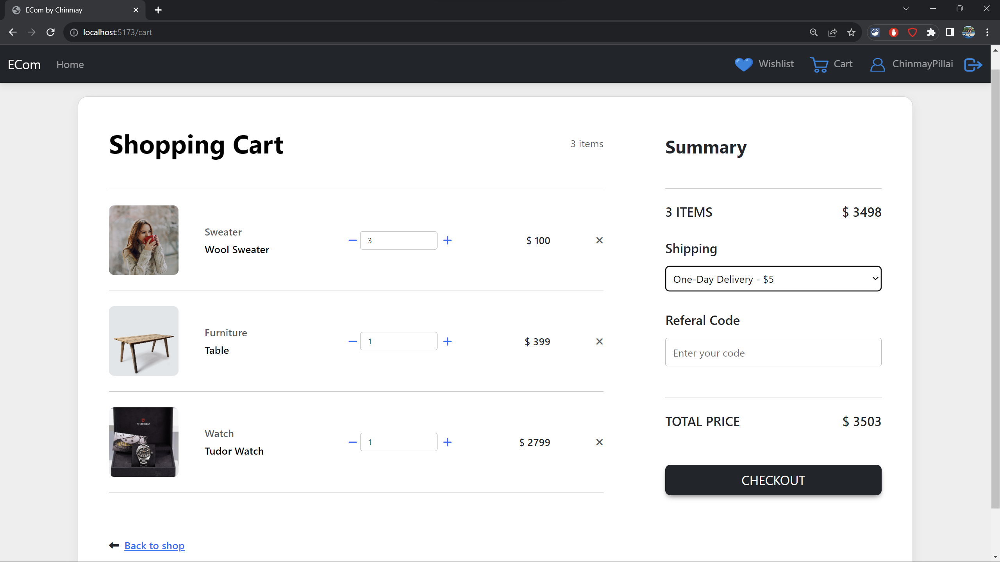
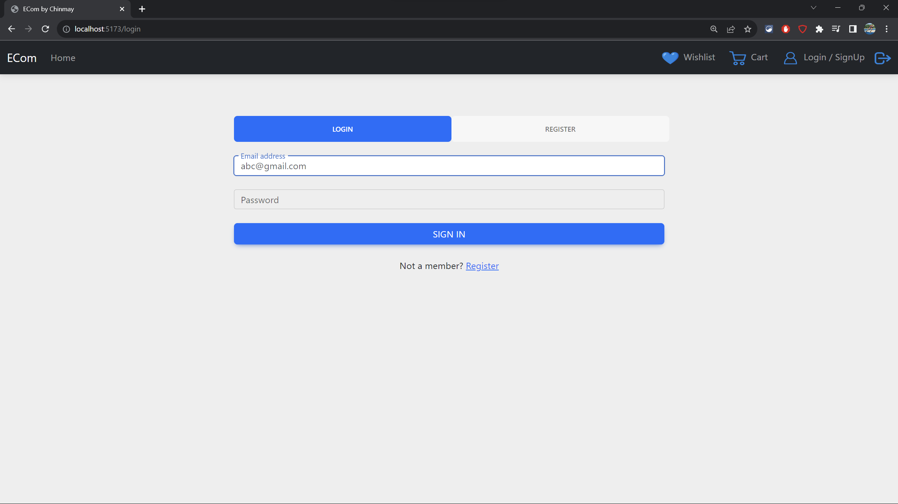
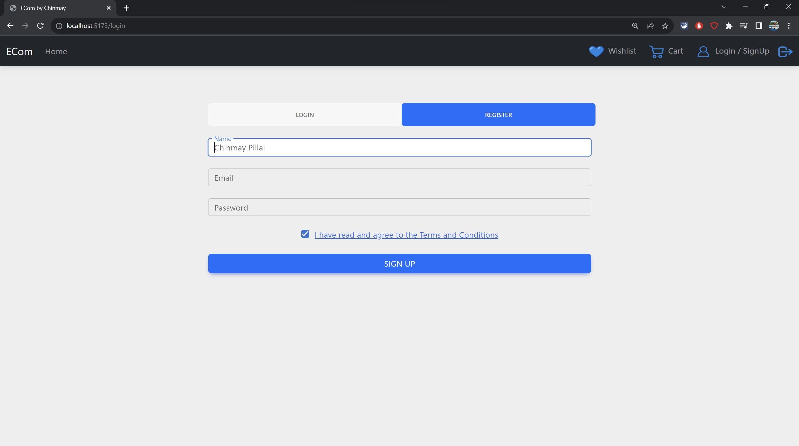

# Full-Stack Web Aplication - ECom by Chinmay

An E-Commerce Full Stack Website made on the MERN tech stack using TypeScript.
 
User specific data of every user is stored as an encrypted document on a MongoDB(NoSQL) database and is update on every interaction with the application.

   

   

   

## Technologies Used:

1. React
2. Express
3. MongoDB
4. Mongoose
5. Node
6. axios
7. jasonwebtoken & jose
8. bcrypt
9. nodemon

## Building

1. `npm install` in the Client and Server folders
2. Install MongoDB Community Server
3. `npm run dev` in the Client and Server folders

The website will be hosted on localhost
